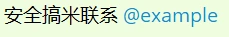
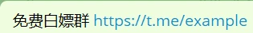
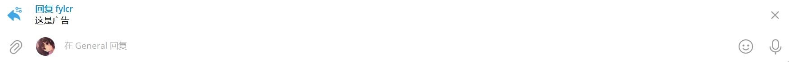
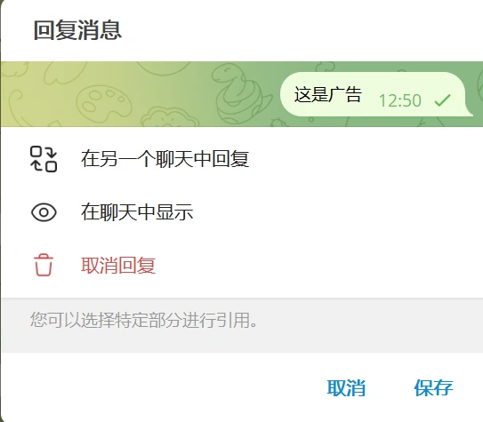
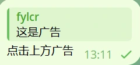
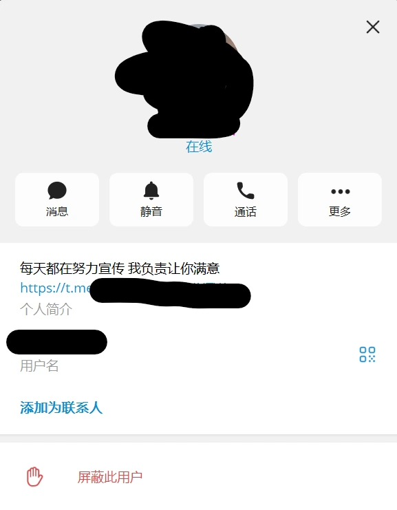
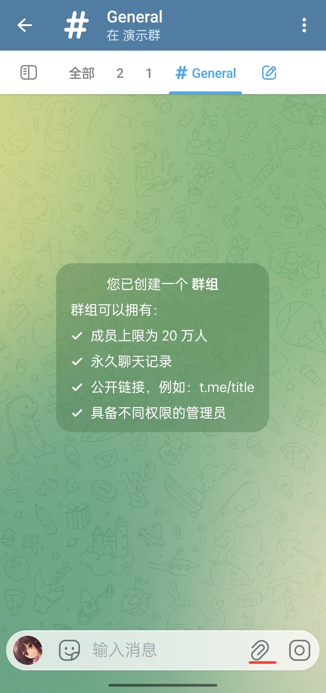
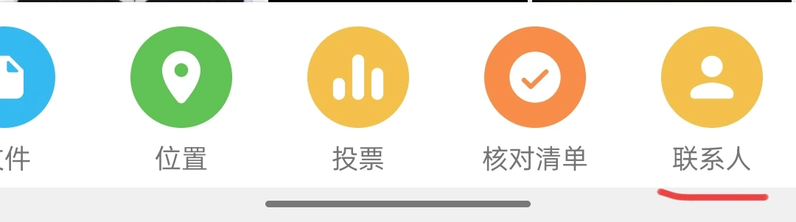
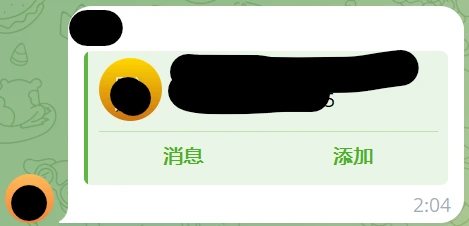

---
prev:
  text: '恶意炸群和诈骗'
  link: '/common-disharmonious-elements/malicious-bombing-and-fraud'
next:
  text: '群管理机器人'
  link: '/robots/summarize'
---
# 广告

在讲广告之前，我们要明确打广告的目的——引流。广告一定会指向群组外的某些东西，无论是人、机器人、群组、频道或者是网站，反正这些东西肯定不是群组内有的。所以我们只需要屏蔽这些指向群外的方法就可以了。下面就是他们常用的方法。

## 1. 直接@或使用链接

首先被打广告的肯定不会自己去打广告，因为要接触的人比较多，被 Telegram 官方封禁的可能性大，所以为了自己的安全，肯定使用其他的账号来引向自己。所以他们就会发送有自己用户名或链接的消息。

如果是机器人、群组或者频道的链接，很多机器人都有对应的设置；但是普通用户的链接就没有机器人进行删除了。（因为我们也会@群里的其他人，而判断被@的人是否在群里会消耗比较大的算力，所以公开的免费机器人不会这样去检测的，当然，付费机器人或者自己编的也可以检测，不过这不是我们所考虑的事情。）

## 2. 直接转发

转发是带转发源的，我们可以点击转发源来指向其他人。

我们可以通过机器人直接禁止转发，不过这种一刀切的方法给正常用户带来困扰。使用违禁词也可以屏蔽这些广告。

## 3. 使用在另外一个聊天里回复

首先我们谈一谈怎么在另外一个聊天里回复。

:::tabs
== Windows

我们回复一个消息时，输入框上方会有要回复的消息。

点击输入框上方消息，会有菜单弹出，选择`在另一个聊天中回复`。

之后选择要发送的群组后随便输入文字就可以发送了。

== Android
:::

这肯定不是一般用户的操作，直接使用机器人禁掉就行了。

## 4. 暗示点击其个人资料首页

有些账号会在个人简介放上广告，点击个人主页就可以看到广告消息。

那么这个账号就会尝试引导用户点击个人主页。

我们常见的应对策略有：

1. 直接识别简介：直接识别简介看看里面是否有广告，但有些时候有些人的简介会挂上个人网站或者其他东西的，很容易误封。而且能给识别简介的机器人很少且不免费。
2. 设置违禁词：像这种引诱用户点击其主页的一般都会提到`头像`、`主页`和`简介`之类的词。不过为了逃避违禁词，这类关键词会：
    * 使用近音字：例如`头象`、`剪介`、`注液`、`筑页`等。
    * 使用 emoji：例如`✂介`、`💉液`等。
    * 使用异形字：例如`簡介`等。
    >当然也会有发送贴纸和图片的，虽然可以设置新人一段时间内不能发贴纸图片，但是影响范围比较大，而且现在并没有自动识别贴纸或图片的机器人（也许可以自己编一个）。

## 5. 发送图片、贴纸

有些人会发包含广告的图片或名字包含广告的贴纸。

这个就没有什么好的方法，可以尝试自己写一个机器人接一个图片识别模型。

## 6. 发送联系人信息

首先讲一下联系人消息是什么样以及怎么发的。

>目前 Windows 端似乎不能发送联系人消息~~（或者我不知道）~~，下面介绍 Android 端怎么发送联系人消息的。

首先点击右下角的附件。

向右滑最下面一列，找到`联系人`这个选项，点击后就可以发送联系人信息了。

发出来的信息是这样的。

这种肯定不是正常用户的操作，直接使用机器人禁掉就行了。

## 7. 使用嵌入链接预览

之前讲到嵌入链接预览说到了相关的知识，这就不在赘述了。

由于这种形式出现的时间比较晚，去年年末才开始流行的，所以很多机器人都没有对此进行封禁。
>不过你要想自己编写机器人的话可以这样做：检测消息里的链接是否与预览的链接一样，如果不一致或者消息甚至连链接都没有，那么大概率是广告。

## 总结

虽然现在 AI 发展很迅猛，但是由于花销和识别率的问题，其实现在应对广告最好的方法还是违禁词，不过收集和设置违禁词确实要花很多的精力，而且由于群里成员的变化，违禁词可能需要发生调整。（例如群里使用繁体字的人增多，而之前对繁体字的封杀力度比较大，我们需要删除或者精确一下违禁词。）
>当然，再好的违禁词也比不上人手动去处理，例如违禁词不能识别图片、近音字和emoji等，但是人却可以，所以依托群组成员的力量很重要，这之后会说到。

现在我们讲完了常见的广告类型，下面我们将详细介绍最好的应对方法——群管理机器人。
