---
prev:
  text: '前言'
  link: '/preface'
next:
  text: '常见的不和谐分子'
  link: '/common-disharmonious-elements/summarize'
---
# 管理权限

这是管理群组的第一步——知道你能做什么。

拥有管理权限的人员分为两种——一种是所有者，另一种是管理员。一个群组只有一个所有者，但是可以有多个管理员。

我们首先来看一看所有者可以干什么。

## 1. 所有者

如果你创建了这个群组的话，那么你就是这个群组的所有者。

> 不过所有者除了自己创建群组这种途径外，还有转让这种途径，这之后会讲到。

首先我要说的是所有者拥有最高权限，之后我们讲管理员的权限的时候很多操作就会与所有者的操作一样，不会再重复一遍，所以即使你不是所有者的话你也不要跳过这一部分去看管理员的那一部分。

还有一个很重要的点，所有的设置别忘记保存了。

### (1) 能打开管理群组菜单

这是最基础的管理权限了，毕竟如果连管理菜单都打不开的话，还怎么管理群组呢？

下面我们来学习怎么打开管理群组菜单。

> 由于我使用了语言包，而不同的汉化语言包或多或少存在差异，所以可能会与你所看到的有些出入，当然，大致的位置是一样的，或者你也可以与我用[同一个汉化包](https://t.me/setlanguage/zh-hans-raw)

:::tabs
== Windows

点击右上角`⁝`→点击`管理群组`→就会弹出管理群组菜单

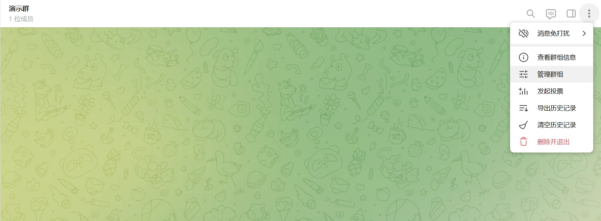

除了这种方法外，还可以：

1. 点击群组名称

2. 点击`更多`

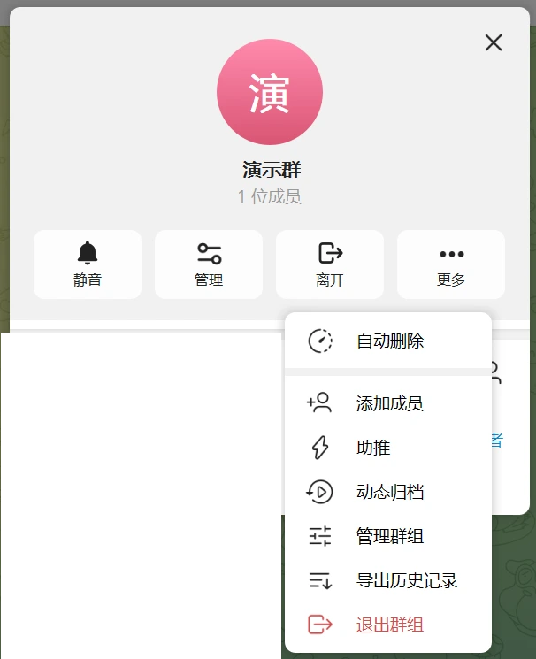
3. 点击`管理群组`

> **注意**
>
>有些群组可能开启了话题模式，这种情况下我们大多打开的是其中某一个话题，如果我们进行上述操作的话会发现我们只能打开话题编辑而不是管理群组菜单了。
>
>大多数的情况下你碰到的是这种情况：
>
>
>
>那么这个时候我们需要需要把标签切换到`全部`这个标签,之后再按照上述操做就能打开管理群组菜单了。
>
>不过你也有可能碰到这种情况：
>
>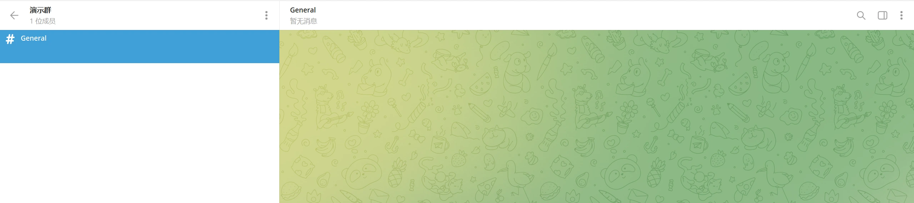
>
>这个时候点击标签上面的群组名称，之后点击`更多`→点击`管理群组`，就能打开管理群组菜单
>
>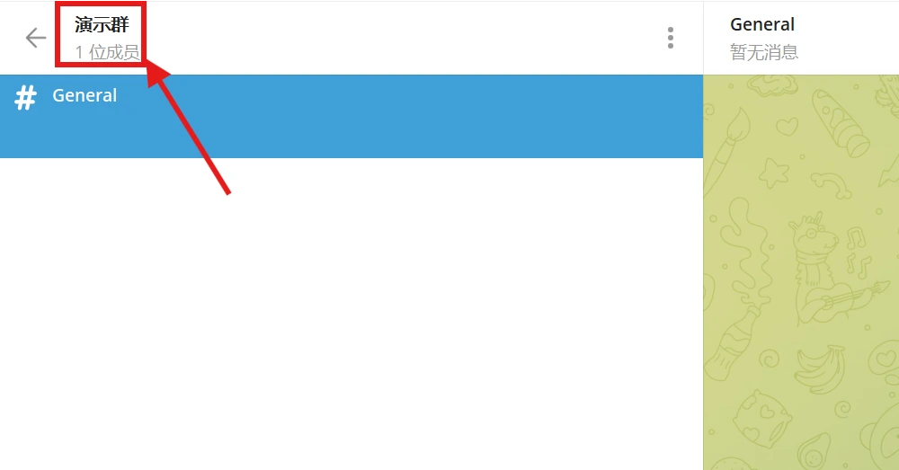
>
>看到这里的朋友可能会有些疑惑，不过不用担心，关于话题的问题我们会之后细说的。

== Android

1. 点击群组名称

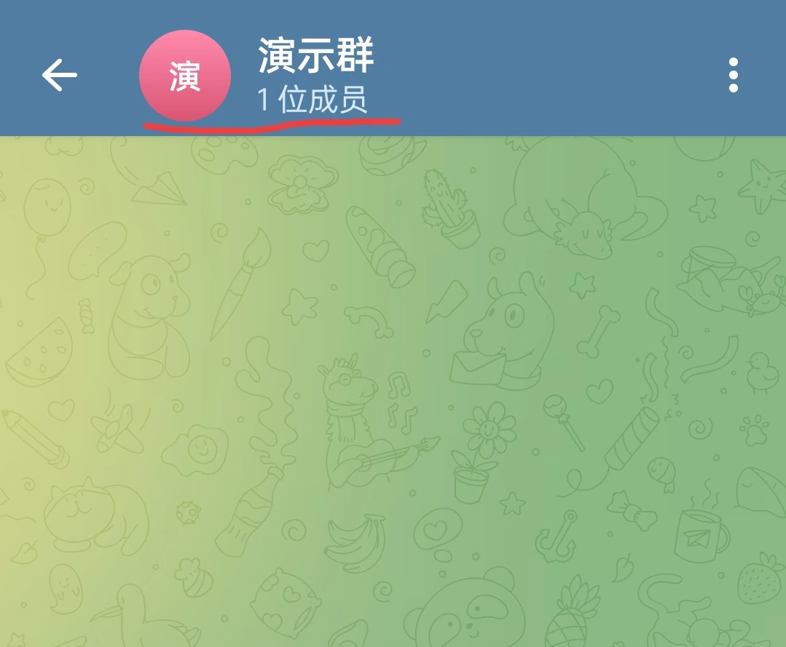
2. 点击右上角`✏️`

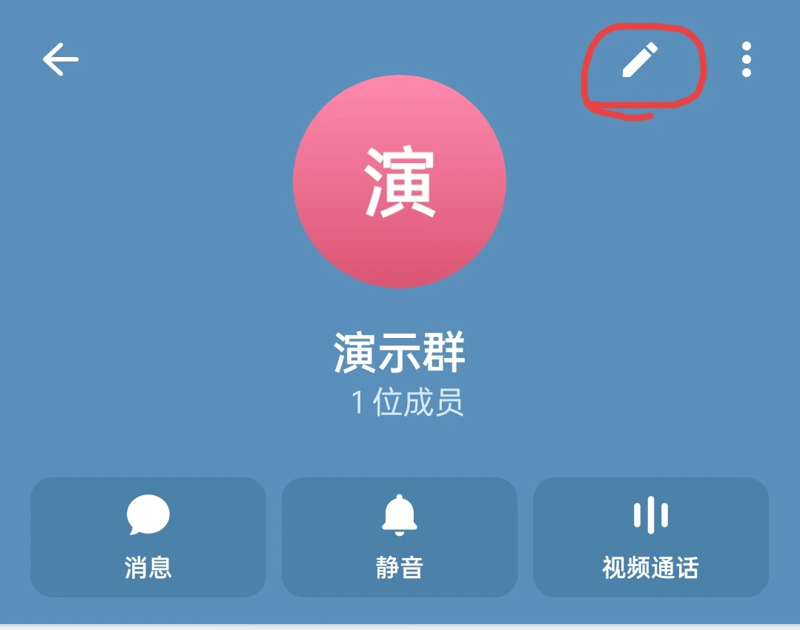
3. 这样就打开了群组管理菜单

> **注意**
>
>有些群组可能开启了话题模式，这种情况下我们大多打开的是其中某一个话题，如果我们进行上述操作的话会发现我们只能打开话题编辑而不是管理群组菜单了。
>
>大多数的情况下你碰到的是这种情况：
>
>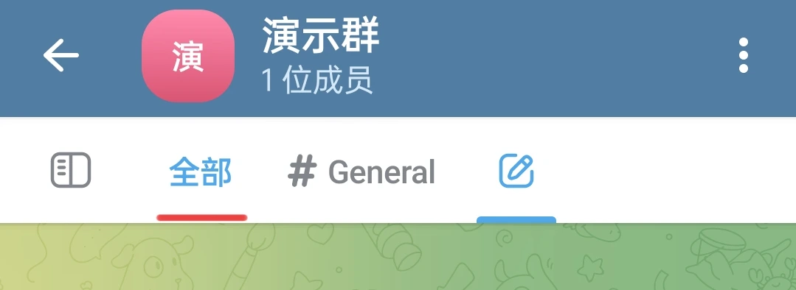
>
>那么这个时候我们需要需要把标签切换到`全部`这个标签,之后再按照上述操做就能打开管理群组菜单了。
>
>不过你也有可能碰到这种情况：
>
>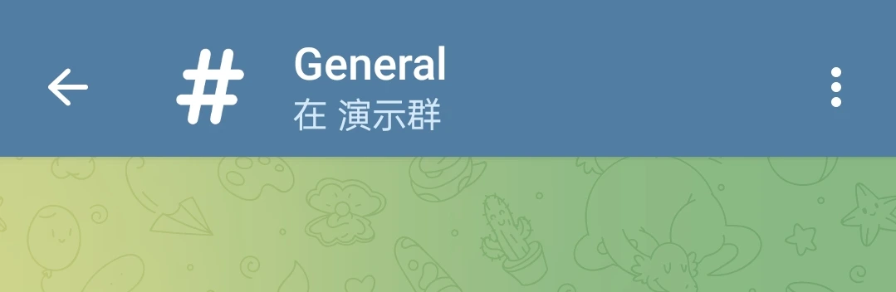
>
>这个时候返回一次，或者点左上角的返回（`←`）,之后点击群组名称→点击右上角`✏️`，就能打开管理群组菜单了。
>
>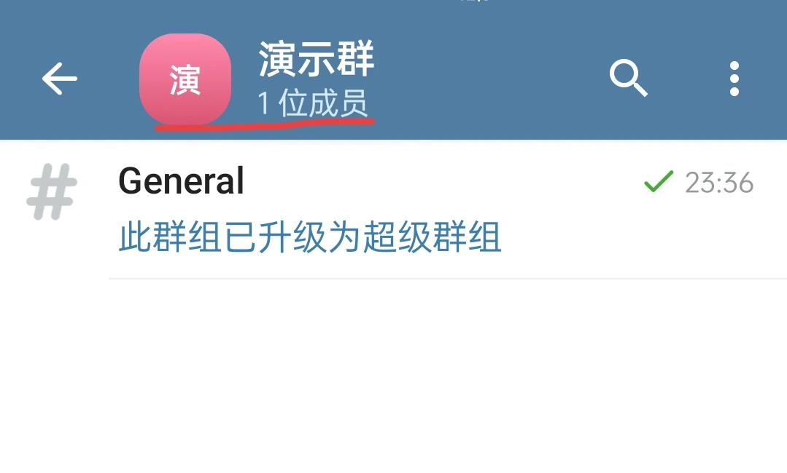
>
>>不过当你彻底关闭客户端（杀后台后）再次重新进入群组的话会直接到第二步，这个时候就直接点击群组名称→点击右上角`✏️`就行了。
>
>看到这里的朋友可能会有些疑惑，不过不用担心，关于话题的问题我们会之后细说的。
:::

> 如果你使用其他系统的或者第三方的客户端话也可以参考一下这上面的流程，或者直接去 Google 搜一下。~~（毕竟我没有用过这些客户端，确实教不了你。）~~

下面我们来看看这个管理群组菜单有什么：
:::tabs
== Windows
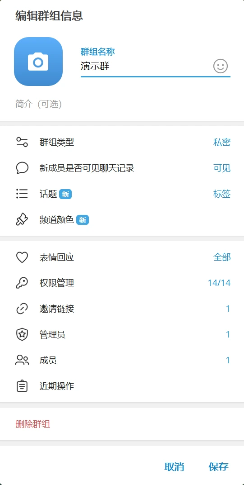

那么从上往下分别是：

1. 编辑群组信息
2. 修改群组类型
3. 设置新成员是否可见之前的聊天记录
4. 设置话题
5. 设置频道颜色（外观）
6. 设置表情回应
7. 管理群组内用户权限
8. 管理邀请链接
9. 查看管理员
10. 查看成员
11. 查看近期操作
12. 删除群组

== Android

那么从上往下分别是：

1. 编辑群组信息
2. 修改群组类型
3. 设置外观
4. 设置话题
5. 设置表情回应
6. 管理群组内用户权限
7. 管理邀请链接
8. 查看管理员
9. 查看成员
10. 查看统计数据
11. 查看近期操作
12. 删除群组

:::

我们接下来按照管理群组菜单来讲一讲所有者的权限。

### (2) 能设置群组信息

所有者可以修改群组的头像、名称和简介。

#### ① 修改群组头像

:::tabs
== Windows

点击左上角`📷`，之后选择上传头像的方式。

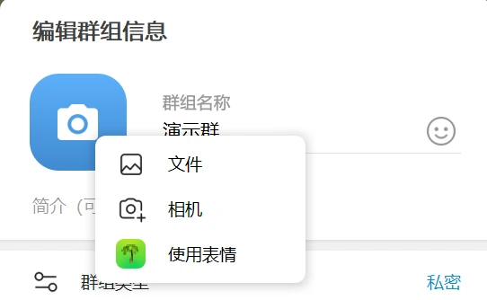

如果已经有头像的话就直接点头像。

== Android
点击`设置图片`，之后选择上传头像的方式。

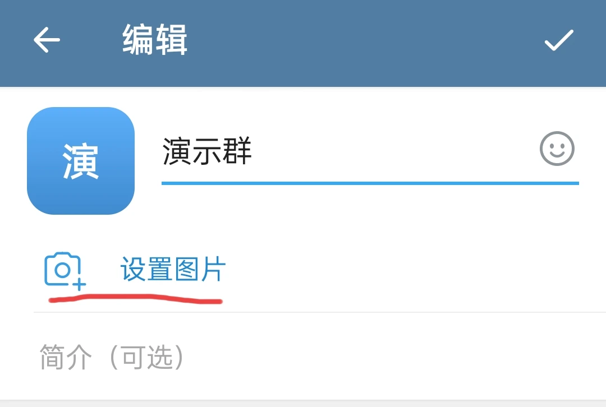

如果已经有头像的话就是`设置新图片`。

:::

#### ② 修改群组名称

:::tabs
== Windows

在`群组名称`修改名称。

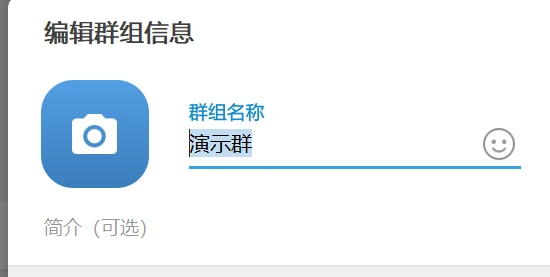

== Android

在头像右侧修改名称。

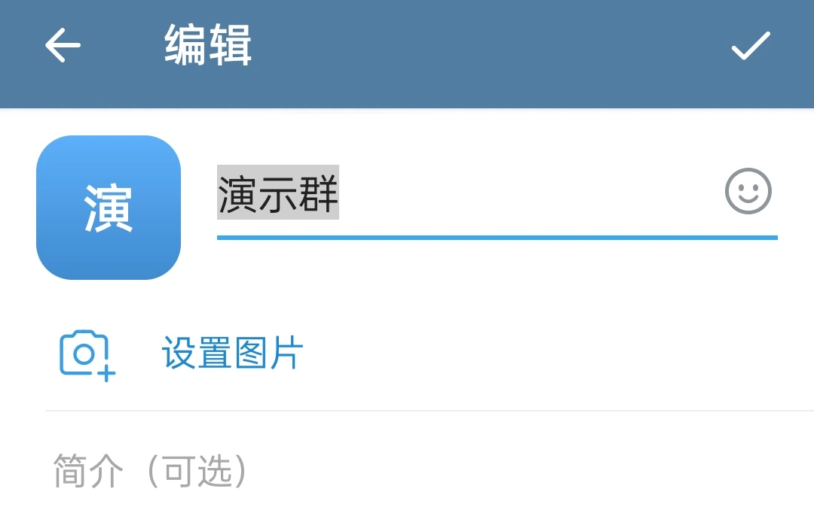
:::

#### ③ 修改群组简介

:::tabs
== Windows

在头像下面的输入框修改

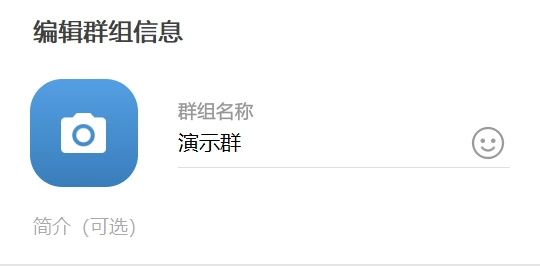

== Android

在修改头像位置下面的输入框修改

:::

### (3) 能设置群组类型

:::tabs
== Windows

打开`群组类型`子菜单。

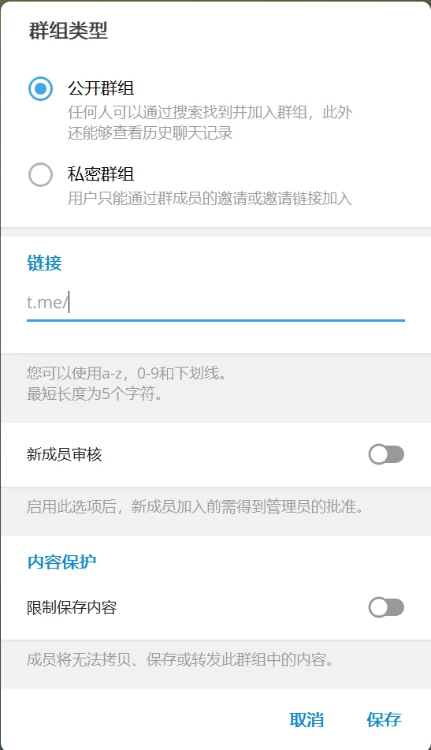

最上面两个单选框是设置群组类型的，其中：

* `公开群组`：没有加入群组的人也能看到群组内的消息。

* `私密群组`：只有加入群组的人才能看到群组内的消息。

如果你把群组设置成`公开群组`，那么你需要给群组设置一个用户名（或者说链接），只需要在`链接`输入你喜欢的用户名就行了

>注意：用户名只能使用小写字母、数字和下划线。最小长度为5字符

在`链接`的下面，是`新成员审核`。如果打开了这个选项，那么加入群组的时候需要管理员批准，关闭这个选项就可以直接加入群组了。

> 如果你打开了`新成员审核`,那么加入流程就变成了这样的：
>
>首先是用户打开了群组链接，然后点击`申请加入群组`。
>
>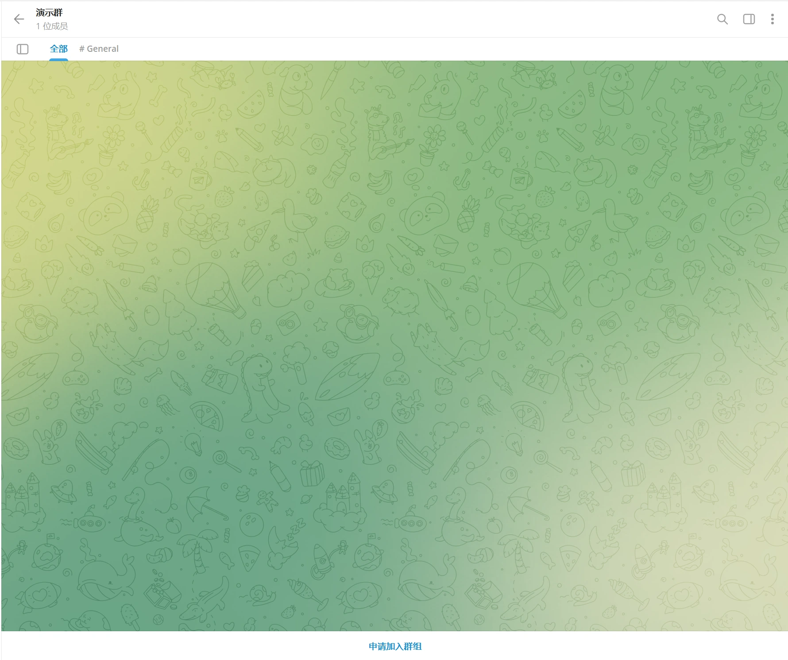
>
>接着 tg 会提醒用户`待管理员同意后即可加入该群组。`。
>
>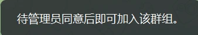
>
>然后管理员会看见`XXX 申请加入群组`
>
>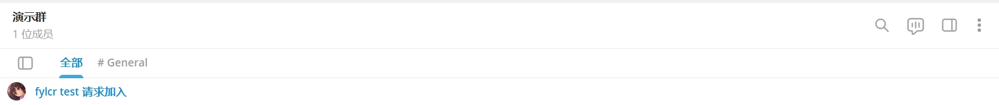
>
>之后点击这条消息，点击`添加到群组`
>
>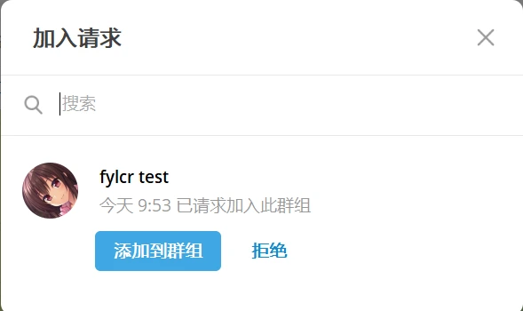
>
>管理员手动批准的流程就是这样，之后还会讲到结合机器人的方法。

如果你把群组设置成`私密群组`，那么用户只能通过`永久链接`加入群组。

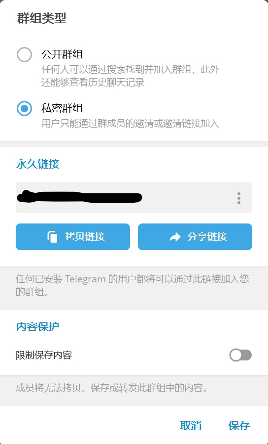

这两个群组类型都有的`内容保护`则是限制群组里的用户保存、复制和转发这条群组内的消息的。

== Android

点击`群组类型`，进入设置群组类型的子菜单。

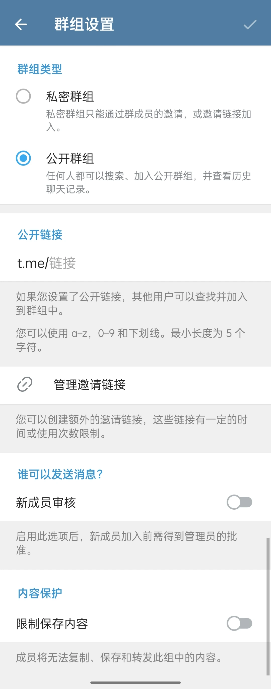

最上面两个单选框是设置群组类型的，其中：

* `公开群组`：没有加入群组的人也能看到群组内的消息。

* `私密群组`：只有加入群组的人才能看到群组内的消息。

如果你把群组设置成`公开群组`，那么你需要给群组设置一个用户名（或者说链接），只需要在`链接`输入你喜欢的用户名就行了

>注意：用户名只能使用小写字母、数字和下划线。最小长度为5字符

在`链接`的下面，是`新成员审核`。如果打开了这个选项，那么加入群组的时候需要管理员批准，关闭这个选项就可以直接加入群组了。

> 如果你打开了`新成员审核`,那么加入流程就变成了这样的：
>
>首先是用户打开了群组链接，然后点击`申请加入群组`。
>
>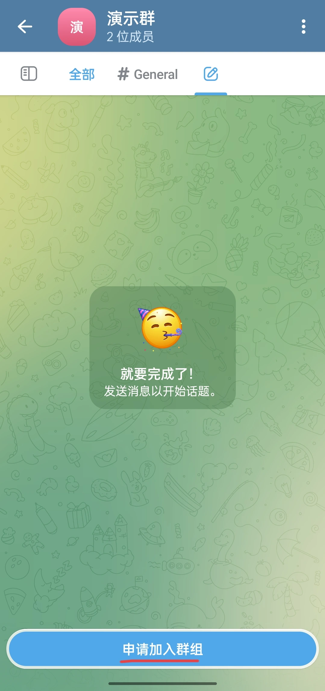
>
>接着 tg 会提醒用户`待管理员同意后即可加入该群组。`。
>
>
>
>然后管理员会看见`n个加入请求`
>
>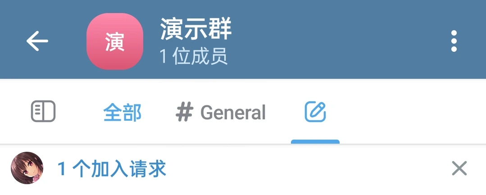
>
>之后点击这条消息，点击`添加到群组`
>
>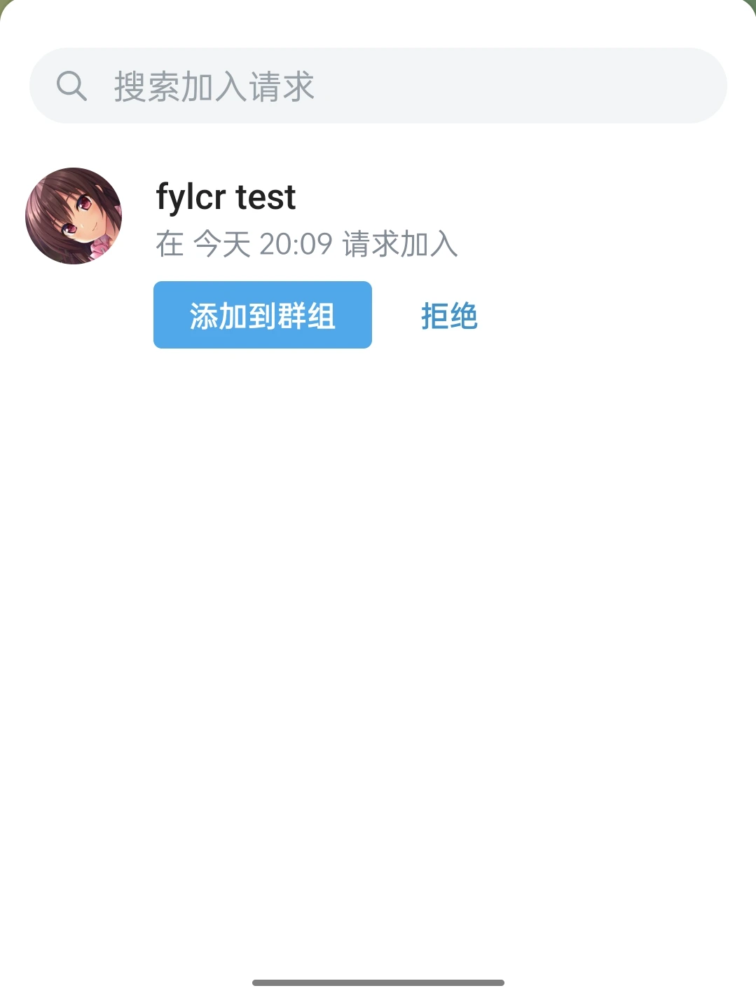
>
>管理员手动批准的流程就是这样，之后还会讲到结合机器人的方法。

如果你把群组设置成`私密群组`，那么用户只能通过`永久链接`加入群组。

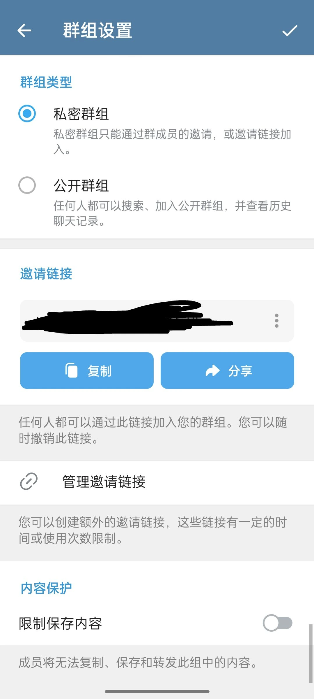

这两个群组类型都有的`内容保护`则是限制群组里的用户保存、复制、截图和转发这条群组内的消息的。

:::

>新成员是否可见之前内容和外观都是很简单的内容，这里不在赘述了。
<!-- 这里就偷个懒，应该没有什么大问题 -->

### (4) 能设置话题

#### ① 设置话题样式

:::tabs
== Windows

打开`话题`子菜单。

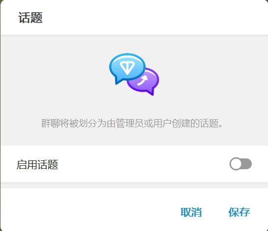

打开`启用话题`后，我们可以看见有两种布局：

`标签`：就是下图这样的

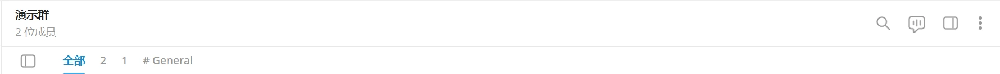

点击最左侧的按钮可以在顶部和左侧互换。（我个人更喜欢放在左侧）

`列表`：就是下图这样的

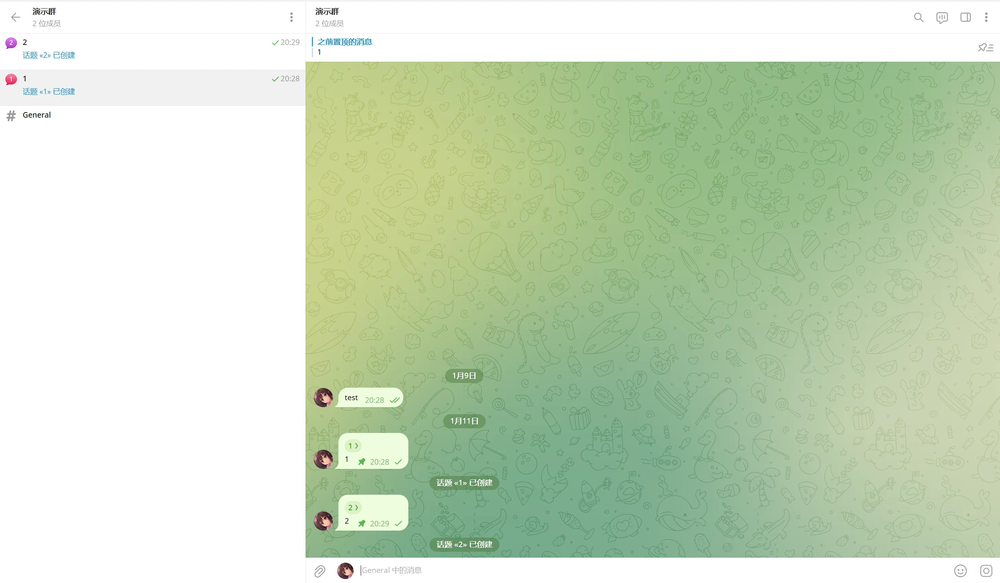

>根据我的观察，中文群更喜欢标签布局，外文群更喜欢列表布局。~~（之前我提到了更常见的情况是标签布局，就是因为中文群的管理员会更喜欢标签布局。）~~

这里有两个特殊的地方：

1. `全部`模式：这里可以查看全部话题的消息，不过不同布局打开全部模式的方法不太一样。

    >标签布局就是点击`全部`就打开了全部模式
    >
    >列表布局则是**完全**关闭 Telegram 后第一次打开群组的时候和进入全部模式。如果是从其他群切换到本群的话只能进入到话题里。
    >>不过从全部模式进入到话题里可以直接返回到全部模式里。~~（于是你就不用担心在全部模式下手欠点到话题了。）~~

    然后在全部模式下发送的消息默认是发送到#General话题，不过回复消息的话会和被回复的消息在同一个话题里。

2. `#General`话题：这是默认创建的话题，而且你删不掉，不过你可以改名字。

== Android

:::

#### ② 创建话题

:::tabs
== Windows
创建话题只能在全部模式下创建。在全部模式下，点击右上角`⁝`→点击`创建话题`。

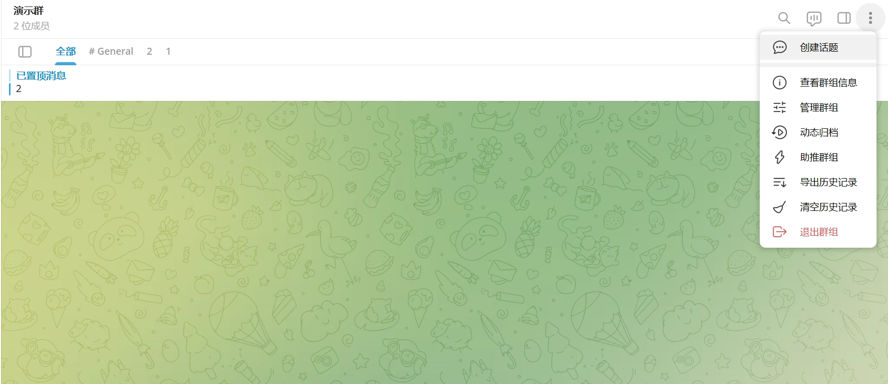

然后填写话题名称并选择话题图标，点击`创建`。

最后在新话题发送一条消息就创建成功了，不过第一条消息是默认置顶的，但是可以解除。

== Android

:::

#### ③ 编辑、删除与锁定话题

:::tabs
== Windows

进入想要操作的话题，点击右上角`⁝`

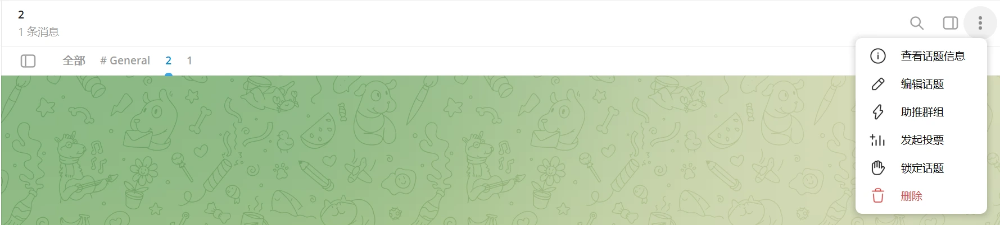

想要修改话题名称和图标的话，点击`编辑话题`。

想要锁定话题的话，点击`锁定话题`。
>锁定话题就是除了管理员外其他用户不能在这个话题里发消息，可以被用来做官方公示等等。

想要删除话题的话，点击`删除`。

== Android

:::

### (5) 能设置表情回应

:::tabs
== Windows

首先讲一下什么是表情回应。

右键任意一条消息，然后可以看到在最上方有一行 emoji。

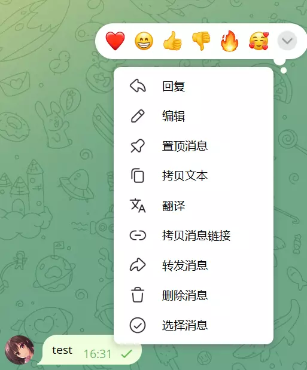

我们随便点一个，然后就可以看到在消息下方会有提示。

这个就是表情回应。

我们可以设置能不能使用表情回应以及可以用哪些表情回应。

打开`表情回应`子菜单后，我们可以看到三个选项：

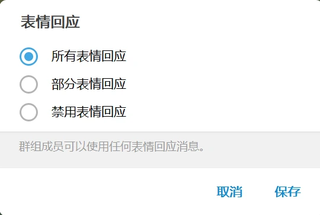

* `所有表情回应`：可以使用任意表情回应群里的消息。

* `部分表情回应`：只能使用部分表情回应群里的消息，使用白名单模式，允许回应的表情在下面输入框设置。

  

* `禁用表情回应`：不允许使用表情回应群里的消息。

== Android

:::

### (6) 能管理用户权限

这个是最重要的功能，我们管理群组主要使用的就是这个功能。

:::tabs
== Windows

打开`权限管理`子`菜单。

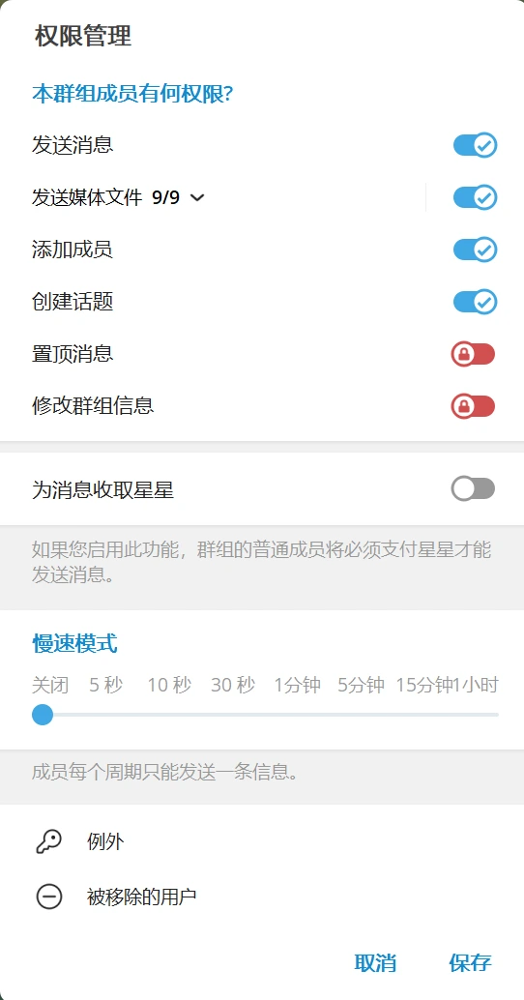

我们从上到下一个一个的讲解：

首先是全体成员权限，这里修改的内容是对全体成员起效的。

1. `发送消息`：用户能不能在群里发送纯文字消息。这个选项关闭后，用户仍可以发送除了嵌入链接预览这一类的其余八类媒体文件。
2. `发送媒体文件`：这有九个子项，点开后面的折叠框我们可以看到这具体的九项：
  
    * `照片`：取消勾选后用户不能发送照片。
        >要注意的一点是 Telegram 有两种发送图片的方法。一种是压缩后在发送的，就是这里说的照片。
        >
        >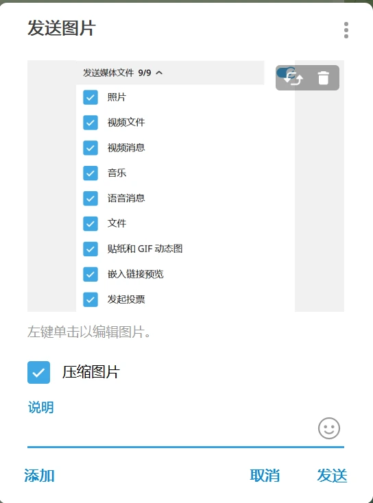
        >
        >发出来的消息是这样的：
        >
        >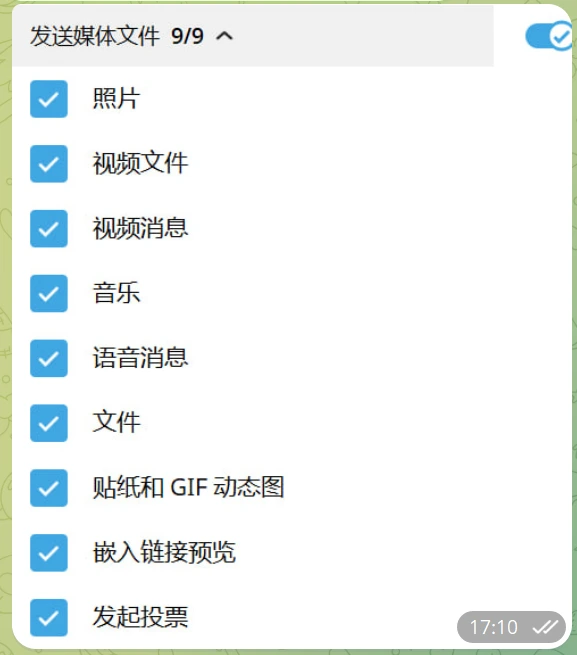
        >
        >另一种是不压缩以文件形式发送的。
        >
        >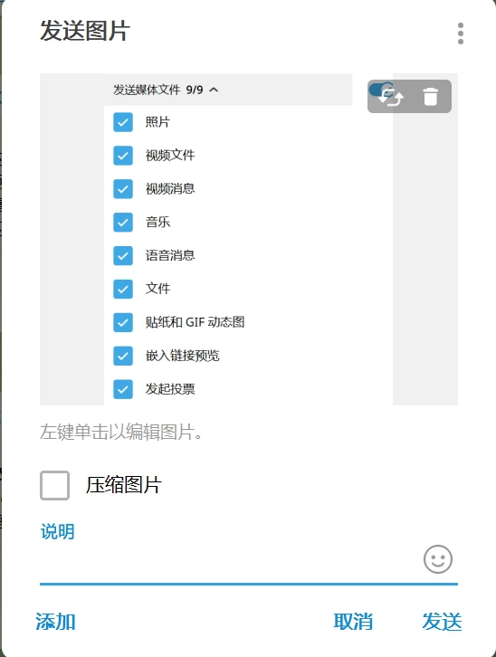
        >
        >发出来的消息是这样的：
        >
        >
        >
        >这里只限制第一种发送照片的方法，而不限制第二种方法
    * `视频文件`：取消勾选后用户不能发送视频文件。
    * `视频消息`：取消勾选后用户不能发送视频消息。
        >什么是视频消息呢？我们在消息输入框为空的时候最右侧会有一个`📸`按钮。
        >
        >
        >
        >长按以后会录制一段不超过60s的圆形视频。和视频文件一样，这个视频在别人看到时会自动静音播放。
        >>如果处于语音消息模式，左键单击一次后就会变成视频消息模式。
    * `音乐`：取消勾选后用户不能发送音乐。
    * `语音消息`：取消勾选后用户不能发送语音消息。
        >什么是语音消息呢？我们在消息输入框为空的时候最右侧会有一个`🎙`按钮。
        >
        >
        >
        >长按以后会录制一段音频，就像微信那样。
        >>如果处于视频消息模式，左键单击一次后就会变成语音消息模式。
    * `文件`：取消勾选后用户不能发送文件。
        >没有压缩的照片也会被当做文件，但是视频文件不会被禁止。
    * `贴纸或 GIF 动态图`：取消勾选后用户不能发送贴纸或 GIF 动态图。
    * `嵌入链接预览`：取消勾选后用户发送消息里的链接不能有预览。
        >我们在输入框里输入了一个链接，Telegram 会自动生成一个预览，这个就是嵌入链接预览。
        >
        >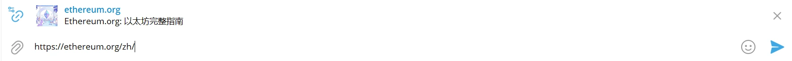
        >
        >发出去的消息是这样的：
        >
        >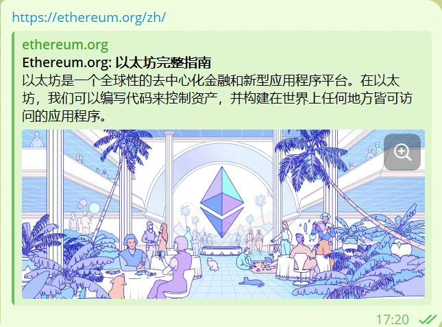
        >
        >但是当 Telegram 自动生成预览后改变输入框内的消息并不会导致嵌入链接预览发生改变,这将会导致嵌入链接预览与文字内容是脱节的，而我们的自动反垃圾系统很多只根据文字内容判断,这就给打广告提供很大的便利。不过嵌入链接预览是一个很方便的功能，关闭以后会带来一定的不便，之后我们会详细讲到这一点。
    * `发起投票`：取消勾选后用户不能发起投票。
3. `添加成员`：用户能不能把其他人拉进这个群里。
4. `创建话题`：用户能不能创建新话题，我建议把这个关掉。
    >不过用户创建的话题可以被我们或者他们自己（创建者）删掉。
5. `置顶消息`：用户可不可以置顶消息，但是公开群组是不能打开的。
    >当你右键一个消息时，可以在弹出的菜单里找到置顶信息这一选项，之后会弹出提示并选择是否通知所有成员，如果勾选了那么在置顶时会通知所有人，不勾选其他人不会收到通知，置顶后则在群组最上方有提示。
6. `修改群组信息`：用户可不可以修改群组信息，但是公开群组是不能打开的。
    >这里的群组信息包括群组名称、头像和简介。

这六项我们限制任意一项后，会多出一个`不限制助推者`，这个是默认关闭的，通常也不会开启。
>什么是助推？你可以理解成拼多多砍一刀的好友助力，积累足够多的助推次数，群组可以使用更高级的功能。不过组推只能由高级用户助推，所以一般情况下助推都是可有可无的东西。~~（因为高级用户没有那么多。）~~

接着是`为消息收取星星`，开启后用户支付星星后才能发送消息。

`慢速模式`限制用户每两次消息之间的时间间隔，比如10s就是发送一条消息10s后才能发送下一条消息。

`例外`就是被特殊对待的用户，在这里可以禁言用户，或者个用户特殊的权限。如果想让这个用户再和大家一样，只需要删除就行了。

`被移除的用户`相当于被封禁，除非所有者或管理员解除限制或手动添加，这里的用户永远都不能重新加入到群里。
== Android

:::

### (7) 能管理邀请链接

:::tabs
== Windows

打开`邀请链接`子菜单，我们可以看到有一个永久链接，通过这个链接用户可以加入群组。

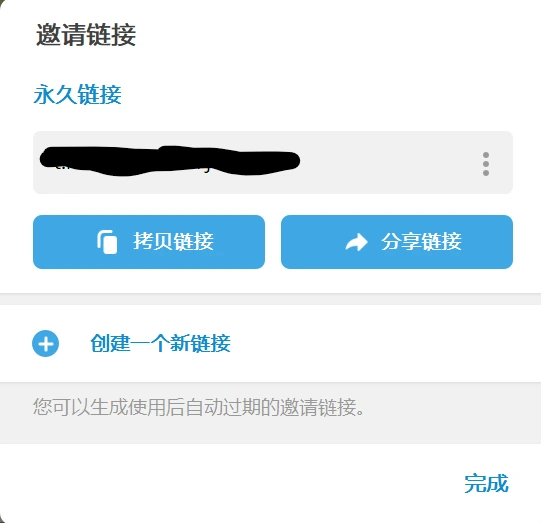

>这个永久链接是可以撤销的。点击链接右侧的`⁝`，之后点击`撤销`，会生成新的永久链接，旧的将会被撤销。

我们可以创建新的邀请链接，点击`创建一个新链接`。

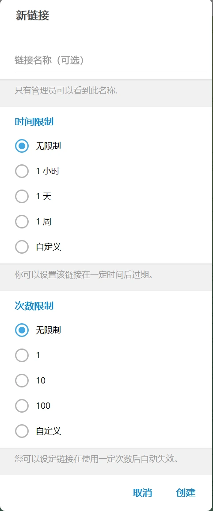

* 我们可以为这个链接起一个名字，以方便与其他链接进行区分。
* 我们可以设置链接失效的时间，在一定时间后自动失效。
* 我们可以设置链接的使用次数，通过此链接加入人数达到一定限制后自动失效。

除了自动失效外，我们可以手动撤销邀请链接。点击链接右侧的`⁝`，之后点击`撤销`，链接就撤销成功了。

撤销后的链接会在`已撤销的链接`里，但是这里的链接只能被删除，不能被恢复。

== Android

:::

### (8) 能设置管理员

:::tabs
== Windows

打开`管理员`子菜单，我们可以看到群里所有的管理员。

>积极的反垃圾策略只有群组人数超过1000时才能开，而且对于中文的支持度并不好。

点击`添加管理员`，可以将群组内其他成员设为管理员。

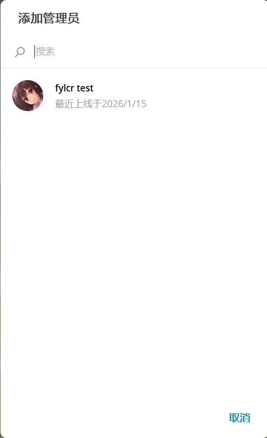

我们点击想要设为管理员的用户，接着可以管理其管理权限。

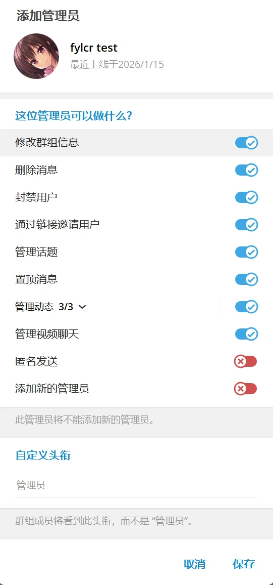

* `修改群组信息`：之前讲用户权限的时候提到了，开启后可以修改群组的名称、头像和简介。（如果是其他可信赖的人则建议打开，机器人的话就建议关闭。）
* `删除消息`：删除其他人发送消息的权利。如果你希望他/她/它能够删除广告消息的话就把这个打开。（一般情况下这个要打开。）
* `封禁用户`：封禁用户的权限，之前在讲用户权限的时候提到了被移除的用户相当于被封禁，有封禁用户权限的管理员才能将用户添加到被移除的用户中。

>我们之后还会详细讲到怎么完成删除广告+封禁用户的操作的。

* `通过邀请链接邀请用户`：创建邀请链接的权限。
* `管理话题`：创建话题和删除话题的权限。（这个可以删除其他人创建的话题。）
* `置顶消息`：置顶消息的权限。
* `管理动态`：这个需要和频道一起使用，和我们没有太大关系。
* `管理视频聊天`：管理视频聊天的权限。开启后用户可以发起视频聊天。
* `匿名发送`：打开后用户发送的消息会变成群组自己发送的形式。

>如果有多名管理员匿名发送的话，唯一有区分度则是消息右上角的自定义头衔。

* `添加新的管理员`：添加管理员的权力。

>如果勾选除了匿名发送的其他所有权限，那么将会出现转让群组所有权这个选项，我们可以把所有权转让给这个用户，让用户成为所有者，而我们则变成管理员，但是除了不能管理被转让用户的权限和自己的权限受其控制外，其他的权限与转让前无异。

* `自定义头衔`：消息右上角的提示。如果开启匿名发送的话自定义头衔确实很重要。~~（否则就像你的群发生精神分裂一样）~~

>如果想把机器人设为管理员，可以打开机器人的资料页面，点击`添加到群组或频道`，选择需要被添加的群组，之后按照上面的方法设置权限就添加成功了。
>
>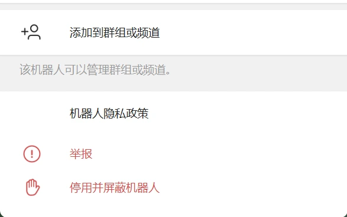

我们如果不想让某个人当管理员的话，只需要回到管理员列表将其移除就可以了。

== Android

:::

### (9) 能查看成员列表

:::tabs
== Windows
打开`成员`子菜单，我们可以看到群组里所有的成员。

>如果点击移除的话相当于封禁。

右键想要管理的成员。

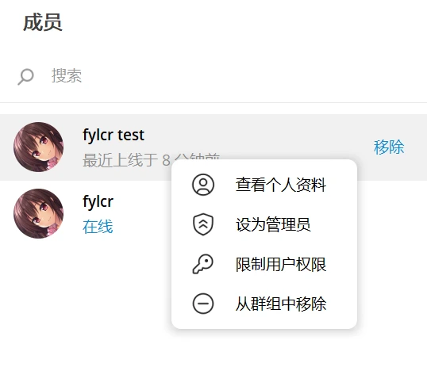

从这里就可以很好地管理某一个用户了，相关的操作在之前也讲了。
== Android

:::

### (10) 能查看近期操作

这是一个很实用的功能，可以看到之前用户偷偷删除或修改的消息以分析相关事情，还可以回溯机器人操作来检查是否存在误封。

接下来我们再讲一些不在群组管理菜单的权限。

### (11) 能删除用户消息

:::tabs
== Windows
我们右键要删除的消息，接着点击`删除消息`。

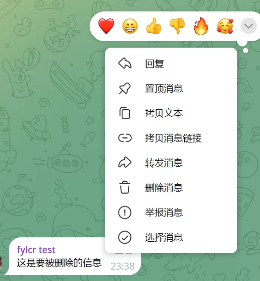

如果只是删除这一消息的话，那么直接点删除就行了；如果是不和谐分子的话，直接选择`举报垃圾消息`+`删除全部消息`+`封禁用户`，然后点击删除。

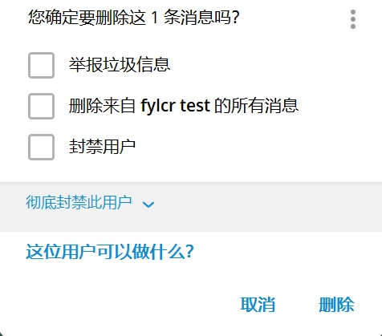

点击下面的`彻底封禁用户`，可以限制用户的详细权限。部分限制权限也许是不错的惩罚措施。

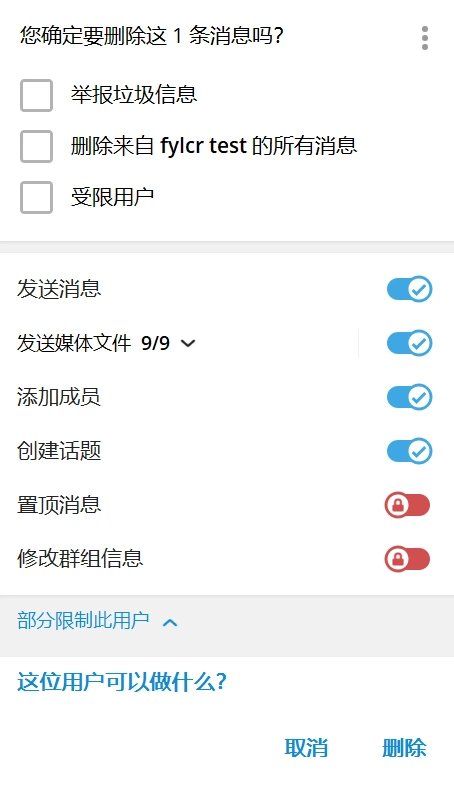

如果选择多条消息的话，那么可以同时对多名用户经行相同操作。
== Android

:::

### (12) 能发起视频聊天

:::tabs
== Windows
在全部模式下，我们点击右上角`💬`按钮。
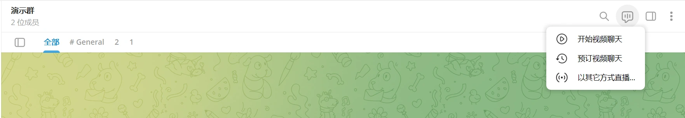

* `开始视频聊天`：立即开启视频聊天。
* `计划视频聊天`：设置某个时间点自动开启视频聊天。
* `以其他方式直播`：通过 rtmps 协议进行推流。

== Android

:::

## 2. 管理员

管理员所能干的事情和所有者一样，所以很多的细节都不会再说一遍。

这里只强调一个点，知道管理员的自己的权限很重要。即使在设置管理员的时候没有给任何权限，但是这个用户还是管理员，他/她/它还是能：

* 查看近期操作
* 查看管理员列表（尤其是匿名发送的时候）

而且由于管理员头衔的存在，即使没有管理群组的目的，一名用户有可能仅仅因为娱乐目的被授予管理员。但请记住，这个看似什么用都没有的头衔也会使用户从普通用户跻身进入管理员的行列。
>这也是很多群管理机器人有权限检测（检测一名管理员是否拥有某项管理权限）这一设定，否则可能仅仅一个空有其名的头衔就让用户获取了设置机器人的权限。但是权限检测这一设定导致一名管理员权限不够大的时候不能设置机器人从而影响管理效率。所以在设置新管理员一定要权衡好这个管理员的权限，不能太大导致群组存在风险，也不能太小导致很多事情无法实现。

这一节我们学习了管理员基础知识与技能，下一节将会讲解常见的不和谐分子类型与相应的应对技巧。
